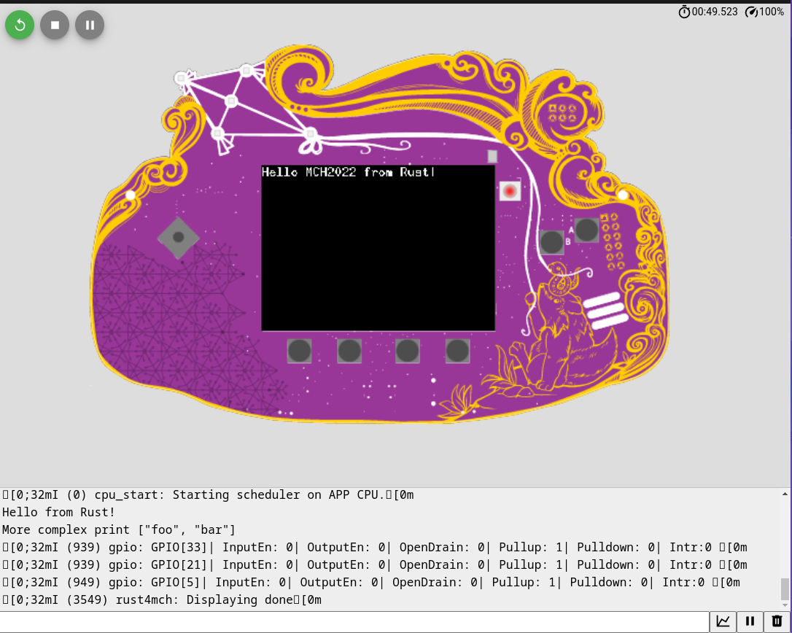

# Rust on the MCH2022 badge
<<<<<<< HEAD
This repo contains instructions and code to run Rust on the MCH2022 badge.
There are two approaches regarding environment:
- [Install the toolchains in your host machine](#installing-the-toolchains)
- [Use devcontainers](#devcontainers)
  - VsCode: Requires VsCode, Remote - Containers extension and Docker installed.
  - Gitpod: Requires a Gitpod account which can be created with a GitLab, GitHub or Bitbucket account.
  - GitHub Codespaces: Requires Codespaces beta.

When using devcontainers, it supports [Wokwi](https://wokwi.com/) simulation:


It also contains [instructions and recommendations on how to start a new project](#creating-your-own-project).

## Installing the toolchains
Install the Rust toolchain for ESP, see full [instructions here](https://github.com/esp-rs/rust-build#xtensa-installation)
1. Install the prerequisites
   - [Linux](https://github.com/esp-rs/rust-build#prerequisites)
   - MacOs: No prerequisites are needed
2. Clone the repository or [download the installer](https://github.com/esp-rs/rust-build#download-installer)
   - If downloading the installer, make it executable: `chmod a+x install-rust-toolchain.sh`
3. Run the following command:
   - Linux/MacOs:
        ```bash
        ./install-rust-toolchain.sh \
        --extra-crates "cargo-espflash ldproxy" \
        --clear-cache "YES" --export-file ~/export-esp.sh \
        --esp-idf-version "release/v4.4" \
        --minified-esp-idf "YES" \
        --build-target "esp32"
        ```
4. Update the environment variables as told at the end of the installation script.

<<<<<<< HEAD
### Build
=======
Find the code on: 
https://github.com/skerkour/kerkour.com/tree/main/2021/rust_on_esp32

Installing the esp-rs Rust toolchain now goes via: 
https://github.com/esp-rs/rust-build

Clone the repository and run: `install-rust-toolchain.sh`

Don't forget to update the PATH and LIBCLAN_PATH variables as told at the end of the installation.

Setup the default environment for esp in this directory `rustup override set esp`.

Then download the example mention in the rust-build README.md and run the 'Cargo first approach'.

<<<<<<< HEAD
## Get example source code
>>>>>>> 625b111 (Latest fixes)
```
cargo build
```
### Flash
We are setting `cargo espflash --monitor` as custom runner in `.cargo/config.toml`, so we can use:
```
cargo run [OPTIONS] [SERIAL] [SUBCOMMAND]
```
And it will flash the target in the SERIAL port and open a serial monitor after
flashing. We can also use `cargo-espflash` directly:
```
cargo espflash [OPTIONS] [SERIAL] [SUBCOMMAND]
```
See [Usage section](https://github.com/esp-rs/espflash/tree/master/cargo-espflash#usage)
of [cargo-espflash](https://github.com/esp-rs/espflash/tree/master/cargo-espflash) for information on arguments.

## Devcontainers
 The repository supports:
 <!-- UPDATE GITPOD LINK IF MERGED -->
-  [Gitpod](https://gitpod.io/): [](https://gitpod.io/github.com/SergioGasquez/rust4mch)
-  [Vs Code Devcontainers](https://code.visualstudio.com/docs/remote/containers#_installation)
-  [GitHub Codespaces](https://docs.github.com/en/codespaces/developing-in-codespaces/creating-a-codespace)
=======
=======

## Installing the toolchains
Install the Rust toolchain for ESP, see full [instructions here](https://github.com/esp-rs/rust-build#xtensa-installation)
1. Install the prerequisites
   - [Linux](https://github.com/esp-rs/rust-build#prerequisites)
   - MacOs: No prerequisites are needed
2. Clone the repository or [download the installer](https://github.com/esp-rs/rust-build#download-installer)
   - If downloading the installer, make it executable: `chmod a+x install-rust-toolchain.sh`
3. Run the following command:
   - Linux/MacOs:
        ```bash
        ./install-rust-toolchain.sh \
        --extra-crates "cargo-espflash ldproxy" \
        --clear-cache "YES" --export-file ~/export-esp.sh \
        --esp-idf-version "release/v4.4" \
        --minified-esp-idf "YES" \
        --build-target "esp32"
        ```
4. Update the environment variables as told at the end of the installation script.
>>>>>>> beaa791 (Add devcontainer support and update readme)
## Configure Wifi
Copy the file './src/wifi_creds_example.rs' to './src/wifi_creds.rs'
Set the Wifi credentials in the file './src/wifi_creds.rs' to the proper SSID and password.
### Build
```
cargo build
```
### Flash
We are setting `cargo espflash --monitor` as custom runner in `.cargo/config.toml`, so we can use:
```
cargo run [OPTIONS] [SERIAL] [SUBCOMMAND]
```
And it will flash the target in the SERIAL port and open a serial monitor after
flashing. We can also use `cargo-espflash` directly:
```
cargo espflash [OPTIONS] [SERIAL] [SUBCOMMAND]
```
See [Usage section](https://github.com/esp-rs/espflash/tree/master/cargo-espflash#usage)
of [cargo-espflash](https://github.com/esp-rs/espflash/tree/master/cargo-espflash) for information on arguments.

## Devcontainers
 The repository supports:
 <!-- UPDATE GITPOD LINK IF MERGED -->
-  [Gitpod](https://gitpod.io/): [](https://gitpod.io/github.com/SergioGasquez/rust4mch)
-  [Vs Code Devcontainers](https://code.visualstudio.com/docs/remote/containers#_quick-start-open-an-existing-folder-in-a-container)
-  [GitHub Codespaces](https://docs.github.com/en/codespaces/developing-in-codespaces/creating-a-codespace)

<<<<<<< HEAD
`cargo build`
>>>>>>> d39cb97 (Updated docs)

> **Warning**
>
> When using GitHub Codespaces, we need to make the ports
> public, [see instructions](https://docs.github.com/en/codespaces/developing-in-codespaces/forwarding-ports-in-your-codespace#sharing-a-port), in order to flash and run
> Wokwi simulations.
>
### Build
-  UI approach:
    - From UI: Press `Build` on the left side of the Status Bar.
    - From the [Command Palette](https://code.visualstudio.com/docs/getstarted/userinterface#_command-palette) (`Ctrl-Shift-P` or `Cmd-Shift-P`) run the `Tasks: Run Build Task` command.
    - `Terminal`-> `Run Build Task` in the menu.
    - With `Ctrl-Shift-B` or `Cmd-Shift-B`.
    - From the [Command Palette](https://code.visualstudio.com/docs/getstarted/userinterface#_command-palette) (`Ctrl-Shift-P` or `Cmd-Shift-P`) run the `Tasks: Run Task` command and
    select `Build`.
- Terminal approach:
    ```
    ./build.sh  [debug | release]
    ```
    > If no argument is passed, `release` will be used as default
=======
> **Warning**
>
> When using GitHub Codespaces, we need to make the ports
> public, [see instructions](https://docs.github.com/en/codespaces/developing-in-codespaces/forwarding-ports-in-your-codespace#sharing-a-port), in order to flash and run
> Wokwi simulations.
>
### Build
-  UI approach:
    - From UI: Press `Build` on the left side of the Status Bar.
    - From the [Command Palette](https://code.visualstudio.com/docs/getstarted/userinterface#_command-palette) (`Ctrl-Shift-P` or `Cmd-Shift-P`) run the `Tasks: Run Build Task` command.
    - `Terminal`-> `Run Build Task` in the menu.
    - With `Ctrl-Shift-B` or `Cmd-Shift-B`.
    - From the [Command Palette](https://code.visualstudio.com/docs/getstarted/userinterface#_command-palette) (`Ctrl-Shift-P` or `Cmd-Shift-P`) run the `Tasks: Run Task` command and
    select `Build`.
- Terminal approach:
    ```
    ./build.sh  [debug | release]
    ```
    > If no argument is passed, `release` will be used as default


### Flash

- UI approach:
    - From UI: Press `Build & Flash` on the left side of the Status Bar.
    - From the [Command Palette](https://code.visualstudio.com/docs/getstarted/userinterface#_command-palette) (`Ctrl-Shift-P` or `Cmd-Shift-P`) run the `Tasks: Run Task` command and
    select `Build & Flash`.
- Terminal approach:
  - Using `flash.sh` script:

    ```
    ./flash.sh [debug | release]
    ```
    > If no argument is passed, `release` will be used as default
- Any alternative flashing method from host machine.


### Wokwi Simulation

- UI approach:

    The default test task is already set to build the project, and it can be used
    in VsCode and Gitpod:
    - From UI: Press `Build & Run Wokwi` on the left side of the Status Bar.
    - From the [Command Palette](https://code.visualstudio.com/docs/getstarted/userinterface#_command-palette) (`Ctrl-Shift-P` or `Cmd-Shift-P`) run the `Tasks: Run Test Task` command
    - With `Ctrl-Shift-,` or `Cmd-Shift-,`
        > **Note**
        >
        > This Shortcut is not available in Gitpod by default.
    - From the [Command Palette](https://code.visualstudio.com/docs/getstarted/userinterface#_command-palette) (`Ctrl-Shift-P` or `Cmd-Shift-P`) run the `Tasks: Run Task` command and
    select `Build & Run Wokwi`.

- Terminal approach:

    ```
    ./run-wokwi.sh [debug | release]
    ```
    > If no argument is passed, `release` will be used as default

> **Warning**
>
>  The simulation will pause if the browser tab is in the background. This may
> affect the execution, especially when debugging.

#### Debugging with Wokwi

Wokwi offers debugging with GDB.

- UI approach:
    1. Run the Wokwi Simulation in `debug` profile
    2. Go to `Run and Debug` section of the IDE (`Ctrl-Shift-D or Cmd-Shift-D`)
    3. Start Debugging by pressing the Play Button or pressing `F5`
    4. Choose the proper user:
        - `esp` when using VsCode or GitHub Codespaces
        - `gitpod` when using Gitpod
- Terminal approach:
    ```
    $HOME/.espressif/tools/xtensa-esp32-elf/esp-2021r2-patch3-8.4.0/xtensa-esp32-elf/bin/xtensa-esp32-elf-gdb target/xtensa-esp32-espidf/debug/rust4mch -ex "target remote localhost:9333"
    ```
    > **Warning**
    >
    > Be sure to build the project in debug mode

    > [Wokwi Blog: List of common GDB commands for debugging.](https://blog.wokwi.com/gdb-avr-arduino-cheatsheet/?utm_source=urish&utm_medium=blog)

>>>>>>> beaa791 (Add devcontainer support and update readme)


<<<<<<< HEAD
<<<<<<< HEAD
### Flash

- UI approach:
    - From UI: Press `Build & Flash` on the left side of the Status Bar.
    - From the [Command Palette](https://code.visualstudio.com/docs/getstarted/userinterface#_command-palette) (`Ctrl-Shift-P` or `Cmd-Shift-P`) run the `Tasks: Run Task` command and
    select `Build & Flash`.
- Terminal approach:
  - Using `flash.sh` script:

    ```
    ./flash.sh [debug | release]
    ```
    > If no argument is passed, `release` will be used as default
- Any alternative flashing method from host machine.


### Wokwi Simulation

- UI approach:

    The default test task is already set to build the project, and it can be used
    in VsCode and Gitpod:
    - From UI: Press `Build & Run Wokwi` on the left side of the Status Bar.
    - From the [Command Palette](https://code.visualstudio.com/docs/getstarted/userinterface#_command-palette) (`Ctrl-Shift-P` or `Cmd-Shift-P`) run the `Tasks: Run Test Task` command
    - With `Ctrl-Shift-,` or `Cmd-Shift-,`
        > **Note**
        >
        > This Shortcut is not available in Gitpod by default.
    - From the [Command Palette](https://code.visualstudio.com/docs/getstarted/userinterface#_command-palette) (`Ctrl-Shift-P` or `Cmd-Shift-P`) run the `Tasks: Run Task` command and
    select `Build & Run Wokwi`.

- Terminal approach:

    ```
    ./run-wokwi.sh [debug | release]
    ```
    > If no argument is passed, `release` will be used as default

> **Warning**
>
>  The simulation will pause if the browser tab is in the background. This may
> affect the execution, especially when debugging.

#### Debugging with Wokwi

Wokwi offers debugging with GDB.

- UI approach:
    1. Run the Wokwi Simulation in `debug` profile
    2. Go to `Run and Debug` section of the IDE (`Ctrl-Shift-D or Cmd-Shift-D`)
    3. Start Debugging by pressing the Play Button or pressing `F5`
    4. Choose the proper user:
        - `esp` when using VsCode or GitHub Codespaces
        - `gitpod` when using Gitpod
- Terminal approach:
    ```
    $HOME/.espressif/tools/xtensa-esp32-elf/esp-2021r2-patch3-8.4.0/xtensa-esp32-elf/bin/xtensa-esp32-elf-gdb target/xtensa-esp32-espidf/debug/rust4mch -ex "target remote localhost:9333"
    ```
    > **Warning**
    >
    > Be sure to build the project in debug mode

    > [Wokwi Blog: List of common GDB commands for debugging.](https://blog.wokwi.com/gdb-avr-arduino-cheatsheet/?utm_source=urish&utm_medium=blog)


## Creating Your own project

=======
>>>>>>> beaa791 (Add devcontainer support and update readme)
Using [cargo-generate](https://github.com/cargo-generate/cargo-generate) is
recomeneded. In order to install it:
 - Append it to the `--extra-crates`: `--extra-crates "cargo-espflash ldproxy cargo-generate"`
 - Install it: `cargo install cargo-generate`

<<<<<<< HEAD
### Std
=======
## Std
>>>>>>> beaa791 (Add devcontainer support and update readme)

Use [esp-idf-template](https://github.com/esp-rs/esp-idf-template) as starting point:
```bash
cargo generate  https://github.com/esp-rs/esp-idf-template
```
`cargo-generate` will as you a few questions, after those, you will have a "Hello, world!"
Rust binary crate for the ESP-IDF framework.

<<<<<<< HEAD
### No-Std
=======
## No-Std
>>>>>>> beaa791 (Add devcontainer support and update readme)

Use [esp-template](https://github.com/esp-rs/esp-template) as starting point:
```bash
cargo generate  https://github.com/esp-rs/esp-template
```
`cargo-generate` will as you a few questions, after those, you will have a bare-metal
minimalist project!

<<<<<<< HEAD
=======
Create a new Rust project with `cargo init` and change directory to the new project directory. \
Set the default target with `rustup override set esp` \
Copy the sdkconfig*, build.rs, partitions.csv and Cargo.toml from this project to your own project. 
Create a directory .cargo and copy the `.cargo/config.toml` from this project to your new .cargo directory. 
Add the 'sdkconfig.default*' and 'build.rs' files from the example project. 
>>>>>>> d39cb97 (Updated docs)
=======
>>>>>>> beaa791 (Add devcontainer support and update readme)

# Inspiration

## Get example source code
```
git clone https://github.com/ivmarkov/rust-esp32-std-demo.git
cd rust-esp32-std-demo/
```

